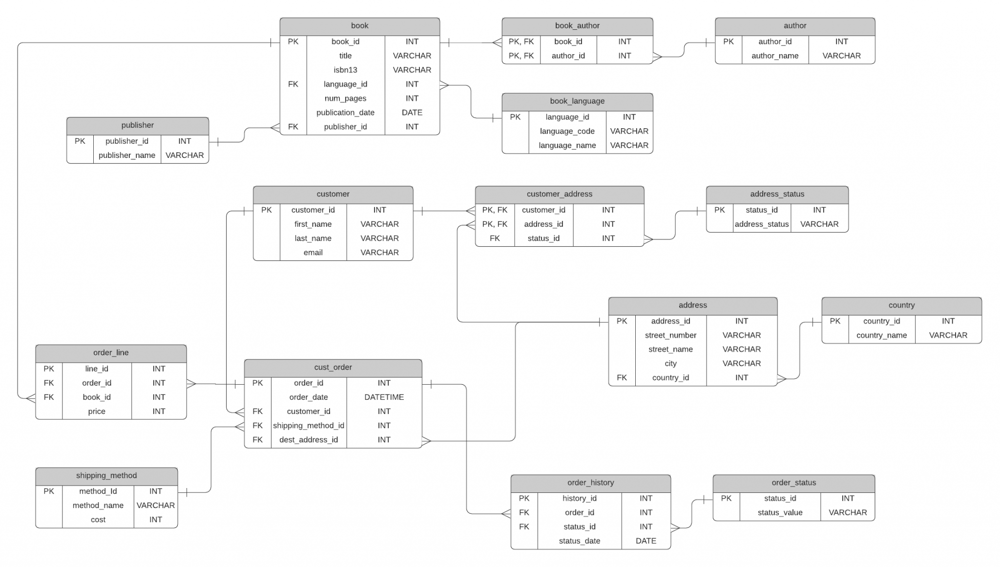

Here you can find PostgreSQL initialization scripts and database ERD diagram

You can populate entire database using `init_all.sql` file.

You can find this sample database at https://www.databasestar.com/