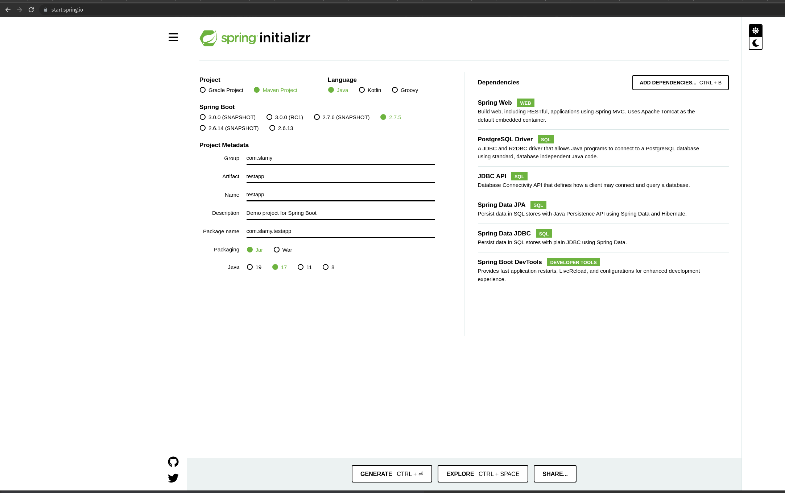
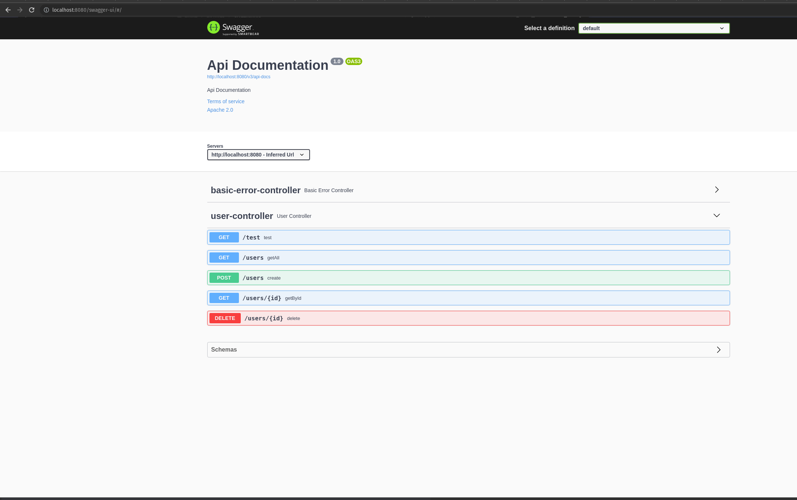

# Using JavaSpring with DB

## Used materials

1. Spring initializer https://start.spring.io/
2. Swagger for spring [PL](https://www.youtube.com/watch?v=ywtFuXYFxo4&ab_channel=PrzemekBykowski)
3. Sample CRUD app [PL](https://www.youtube.com/watch?v=N5MCeV8Wjcs&ab_channel=Jaknauczy%C4%87si%C4%99programowania)
4. DB connection and repository [EN](https://www.youtube.com/watch?v=8SGI_XS5OPw&list=PLwvrYc43l1MzeA2bBYQhCWr2gvWLs9A7S&ab_channel=Amigoscode)

## Task
1. Initialize Java Spring project. Use initialization configuration from .
2. Create `User` entity with
   1. id (long, auto increment, primary key)
   2. first name (string, not null)
   3. last name (string, not null)
   4. email (string, not null, unique)
   5. age (int)
3. Create `UserRepository`
4. Create REST `UserController` with routes:
   1. Get all users
   2. Get user by id
   3. delete user
   4. create user
5. [Optional] Set up Swagger UI for the project

Possible end result:
